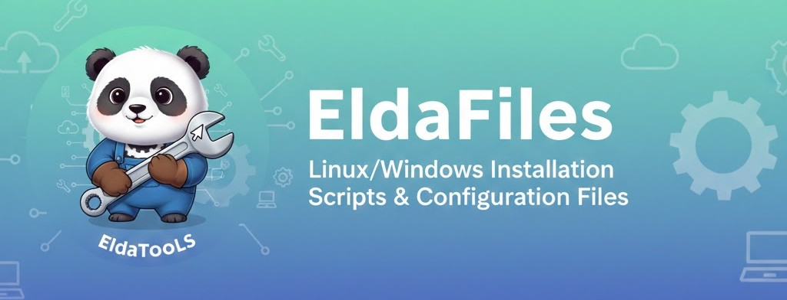

  

# dotfiles by Eldayia

Dépôt centralisant mes fichiers de configuration et scripts d'installation pour Windows et Linux.

## Structure du projet

A remplir

## Contenu

### Windows

* Scripts PowerShell pour l'installation automatique de logiciels
* Fichiers de configuration d'applications Windows
* Scripts de setup d'environnement de développement

### Linux

* Scripts Bash pour l'installation de paquets
* Dotfiles et configurations système
* Scripts de setup d'environnement de développement

### Partagé

* Configurations d'applications cross-platform
* Listes de logiciels recommandés
* Documentation commune

## Contribuer

Ce dépôt est personnel mais les suggestions sont bienvenues via issues ou pull requests.

