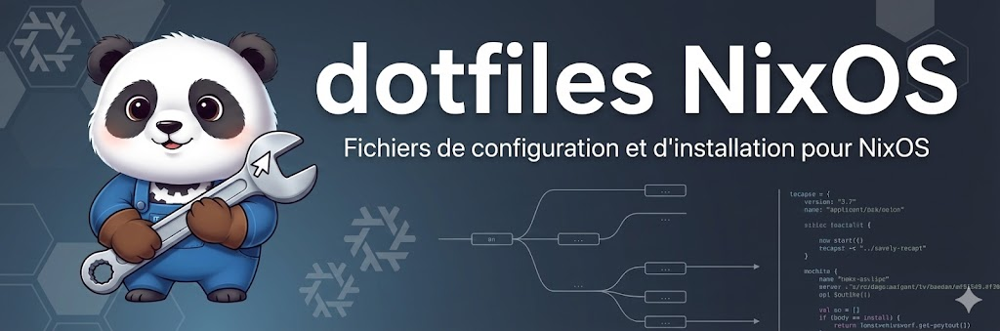

<p align="center">
  
</p>

<p align="center">
  <a href="https://nixos.org/"></a>
  <a href="https://www.gnu.org/software/stow/"></a>
  <a href="https://github.com/ghostty-org/ghostty"></a>
  <a href="https://hyprland.org/"></a>
  <a href="https://neovim.io/"></a>
  <a href="https://www.nushell.sh/"></a>
  <a href="https://starship.rs/"></a>
  <a href="https://catppuccin.com/"></a>
</p>

# dotfiles NixOS by Eldayia

Configuration complète pour NixOS avec environnement X11 + i3. Support optionnel Hyprland/Wayland disponible. Cette branche est dédiée exclusivement à NixOS et utilise GNU Stow pour la gestion des dotfiles.

## 🆕 Nouveautés récentes

### Outils de déploiement et diagnostic
- ✅ **Script de déploiement VM automatique** (`deploy-vm.sh`) - Déploiement complet en une commande
- ✅ **Outils de diagnostic Hyprland** - Suite complète de scripts de débogage
- ✅ **Résolution automatique des conflits Stow** - Plus de problèmes de liens symboliques
- ✅ **Collecte automatique des logs** - Envoi vers Hastebin pour partage facile

### Configurations complètes
- ✅ **20+ applications configurées** - Atuin, Bat, Btop, Direnv, Dunst, Edge, Fastfetch, GH CLI, Git, Ghostty, Kitty, Nushell, Nvim, Starship, Warp, i3, Yazi, Zellij
- ✅ **Configuration X11 + i3 optimisée** - Window manager léger et performant pour VMware
- ✅ **Architecture modulaire** - Séparation claire X11/Wayland/Interface/Applications
- ✅ **Support Wayland/Hyprland disponible** - Modules désactivés par défaut, facilement activables
- ✅ **Thème cohérent** - Apparence harmonieuse sur toutes les applications

### Documentation enrichie
- ✅ **Guide de déploiement VM** (`DEPLOY-VM.md`)
- ✅ **Guide de dépannage** (`TROUBLESHOOT.md`)
- ✅ **Configuration minimale de test** - Pour diagnostiquer rapidement

---

> Merci à <b>RikiLaNeko</b> de m’avoir fait découvrir NixOS et pour sa base de config <a href="https://gitlab.com/RikiLaNeko/dotfiles.git">dotfiles</a>

---

## 📦 Stack technique

### Système de base
- **OS** : NixOS 24.05
- **Display Manager** : Ly
- **Window Manager** : i3 (X11) - **ACTIF** | Hyprland (Wayland) optionnel
- **Shell** : Nushell (défaut système)
- **Audio** : PipeWire (ALSA + PulseAudio + RTKit)

### Environnement graphique
- **Terminal** : Warp Terminal (principal), Kitty (secondaire), Ghostty
- **Launcher** : dmenu (i3), rofi, wofi (Hyprland)
- **Status Bar** : i3status/i3blocks (i3), waybar (Hyprland)
- **Notifications** : Dunst
- **Clipboard** : xclip (X11), wl-clipboard (Wayland)

### Éditeurs & Développement
- **Éditeurs** : Neovim
- **Gestion de code** : Git, GitHub CLI (gh)
- **Nix** : nixpkgs-fmt

### Navigateurs & Communication
- **Navigateurs** : Microsoft Edge, Chromium
- **Communication** : Vesktop (Discord client)

### Multimédia
- **Audio** : playerctl, pavucontrol, pulsemixer
- **Vidéo** : VLC
- **Graphisme** : GIMP
- **Téléchargement** : qBittorrent

### Outils CLI - Productivité
- **Monitoring** : btop, glances, iotop, dool, procs, lsof
- **Info système** : fastfetch, lsb-release
- **Navigation** : yazi (file manager), zoxide (cd intelligent), fzf, fd, tree
- **Recherche** : ripgrep, fzf
- **Visualisation** : bat, eza
- **Stockage** : ncdu, dysk
- **Prompt** : Starship
- **History** : Atuin
- **Multiplexeur** : Zellij
- **Dotfiles** : GNU Stow
- **Environnements** : direnv
- **Documentation** : tldr
- **Recording** : asciinema, asciinema-agg
- **Utilitaires** : pay-respects, progress, libnotify

### Outils réseau
- **Téléchargement** : wget, curl
- **DNS** : dnsmasq, dog
- **HTTP** : httpie
- **Scan** : nmap
- **Monitoring** : mtr, mosh
- **Utilitaires** : ipcalc, openssl

### Cybersécurité
- **Reconnaissance** : naabu, amass, masscan, theharvester, dnsenum, dnsrecon
- **Web Testing** : ffuf, httpx, Burp Suite
- **Cracking** : Hydra, John the Ripper, Hashcat
- **Analyse réseau** : Wireshark, netcat

### Archives & Compression
- **Outils** : zip, unzip, unp, p7zip

## 📁 Structure du dépôt

```
dotfiles/
├── nixos/                        # Configuration système NixOS
│   ├── configuration.nix         # Point d'entrée (importe tous les modules)
│   ├── hardware-configuration.nix # Configuration matérielle (auto-générée)
│   ├── modules/                  # Modules de configuration par thème
│   │   ├── boot.nix              # Bootloader UEFI
│   │   ├── network.nix           # Réseau et hostname
│   │   ├── locale.nix            # Localisation et clavier
│   │   ├── users.nix             # Utilisateurs et shell
│   │   ├── fonts.nix             # Polices système
│   │   ├── graphics.nix          # Configuration graphique (Mesa, VMware, EGL)
│   │   ├── vmware.nix            # Support VMware (open-vm-tools)
│   │   ├── hyprland.nix          # Configuration Hyprland
│   │   ├── packages.nix          # Paquets système de base
│   │   ├── archives.nix          # Outils de compression
│   │   ├── communication.nix     # Discord, Telegram, etc.
│   │   ├── cybersecurity.nix     # Outils de sécurité
│   │   ├── development.nix       # Outils de développement
│   │   ├── multimedia.nix        # Lecteurs audio/vidéo
│   │   ├── network-tools.nix     # Wireshark, nmap, etc.
│   │   ├── terminal-utils.nix    # Outils CLI
│   │   └── web.nix               # Navigateurs
│   └── services/                 # Services système
│       ├── audio.nix             # PipeWire et son
│       ├── display-manager.nix   # Ly display manager
│       ├── ssh.nix               # OpenSSH serveur
│       ├── nvidia.nix            # Configuration GPU Nvidia (bare metal)
│       ├── amd.nix               # Configuration GPU AMD (bare metal)
│       └── intel.nix             # Configuration GPU Intel (bare metal)
├── .config/                      # Configurations utilisateur
│   ├── hypr/                     # Hyprland (window manager)
│   │   ├── hyprland.conf         # Configuration principale
│   │   ├── hyprland-wrapper.sh   # Wrapper de lancement
│   │   ├── debug-env.sh          # Diagnostic variables d'env (Ctrl+D)
│   │   └── check-graphics.sh     # Diagnostic graphique (Ctrl+Shift+D)
│   ├── nvim/                     # Neovim
│   ├── waybar/                   # Barre d'état
│   ├── wofi/                     # Lanceur d'applications
│   ├── dunst/                    # Gestionnaire de notifications
│   ├── kitty/                    # Terminal Kitty
│   ├── ghostty/                  # Terminal Ghostty
│   ├── nushell/                  # Shell Nushell
│   ├── git/                      # Configuration Git globale
│   ├── gh/                       # GitHub CLI
│   ├── btop/                     # Moniteur système
│   ├── fastfetch/                # Affichage infos système
│   ├── yazi/                     # File manager TUI
│   ├── zellij/                   # Multiplexeur de terminal
│   ├── atuin/                    # Historique de commandes
│   ├── bat/                      # Cat avec coloration syntaxique
│   ├── direnv/                   # Gestion d'environnements
│   └── starship.toml             # Prompt Starship
├── scripts/                      # Scripts d'installation et synchronisation
│   ├── install-prep.sh           # Préparation installation initiale
│   ├── install-update.sh         # Mise à jour config NixOS vers /etc/nixos/
│   ├── deploy-vm.sh              # Déploiement automatique sur VM
│   ├── fix-stow-conflicts.sh     # Résolution conflits Stow
│   ├── sync-all.sh               # Sync dotfiles + NixOS vers Git
│   ├── sync-dotfiles.sh          # Sync uniquement dotfiles vers Git
│   └── sync-nixos.sh             # Copie /etc/nixos vers dépôt + sync
├── debug/                        # Scripts et documentation de diagnostic
│   ├── check-vmware-3d.sh        # Vérification accélération 3D VMware
│   ├── diagnose-hyprland.sh      # Diagnostic complet Hyprland
│   ├── check-status.sh           # Vérification rapide état
│   ├── start-hyprland.sh         # Lancement assisté Hyprland
│   ├── collect-logs.sh           # Collecte et envoi logs vers Hastebin
│   ├── test-hyprland.sh          # Test automatique fonctionnalités
│   └── HYPRLAND_DEBUG.md         # Documentation débogage
├── .stow-local-ignore            # Fichiers à ignorer lors du déploiement Stow
├── CLAUDE.md                     # Directives pour IA (WARP + Claude)
├── DEPLOY-VM.md                  # Guide de déploiement sur VM
├── TROUBLESHOOT.md               # Guide de dépannage Hyprland
├── README.md                     # Ce fichier
└── STOW.md                       # Documentation GNU Stow
```

## 🚀 Installation complète

### 1. Préparation de l'environnement NixOS

Lors de l'installation de NixOS, après le partitionnement et avant la première configuration :

```bash
# Monter les partitions (exemple avec UEFI)
mount /dev/sdaX /mnt
mkdir -p /mnt/boot
mount /dev/sdaY /mnt/boot

# Générer la configuration de base
nixos-generate-config --root /mnt
```

### 2. Cloner le dépôt (branche nixos)

**Important :** Ce dépôt utilise la branche `nixos` pour la configuration NixOS.

```bash
# Depuis l'environnement d'installation NixOS
cd /mnt/home

# Cloner directement la branche nixos
git clone -b nixos https://github.com/VOTRE_USERNAME/dotfiles.git
cd dotfiles
```

### 3. Préparer l'installation avec le script

Le script `scripts/install-prep.sh` automatise la copie de la configuration vers `/mnt/etc/nixos/` :

```bash
# Rendre le script exécutable
chmod +x scripts/install-prep.sh

# Exécuter le script (copie les modules et configuration.nix)
sudo ./scripts/install-prep.sh
```

### 4. Adapter la configuration matérielle

**IMPORTANT :** Préservez votre configuration matérielle générée :

```bash
# Le script install-prep.sh ne touche PAS à hardware-configuration.nix
# Votre hardware-configuration.nix généré reste intact dans /mnt/etc/nixos/

# Vérifier que les deux fichiers sont présents
ls -la /mnt/etc/nixos/
# Vous devriez voir :
# - configuration.nix (copié depuis le dépôt)
# - hardware-configuration.nix (généré par nixos-generate-config)
# - modules/ (copié depuis le dépôt)
# - services/ (copié depuis le dépôt)
```

### 5. Personnaliser la configuration

Avant l'installation, modifiez les paramètres selon vos besoins :

```bash
# Éditer le nom d'hôte
sudo nvim /mnt/etc/nixos/modules/network.nix

# Éditer le nom d'utilisateur et le shell
sudo nvim /mnt/etc/nixos/modules/users.nix

# Ajuster le fuseau horaire si nécessaire
sudo nvim /mnt/etc/nixos/modules/locale.nix
```

### 6. Installer NixOS

```bash
# Installation du système avec la configuration
sudo nixos-install

# Définir le mot de passe root
# (le script vous demandera de le faire)

# Redémarrer
reboot
```

### 7. Post-installation : Déployer les dotfiles avec Stow

Après le redémarrage et la connexion, déployez les configurations utilisateur :

```bash
# Se connecter avec votre utilisateur
# Aller dans le dépôt dotfiles
cd ~/dotfiles

# Méthode 1 : Tout déployer (recommandé)
# Le fichier .stow-local-ignore exclut automatiquement nixos/, README.md, etc.
stow -v -t ~ .

# Méthode 2 : Déployer uniquement .config/
stow -v -t ~ .config

# Méthode 3 : Sélectif par application
stow -v -t ~ .config/hypr
stow -v -t ~ .config/waybar
stow -v -t ~ .config/nvim

# Vérifier les liens symboliques créés
ls -la ~/.config/
```

**Note :**
- Stow crée des liens symboliques depuis `~/dotfiles/.config/*` vers `~/.config/*`
- Le fichier `.stow-local-ignore` gère automatiquement l'exclusion des fichiers système, documentation et `nixos/`
- La configuration NixOS (`nixos/`) n'est **pas** gérée par Stow (elle va dans `/etc/nixos/`)

Pour plus de détails sur l'utilisation de Stow, consultez [STOW.md](STOW.md).

### 8. Appliquer les configurations

```bash
# Relancer Hyprland (depuis le display manager ou)
# Appuyez sur SUPER+SHIFT+Q puis reconnectez-vous

# Ou redémarrer le système pour tout charger proprement
sudo reboot
```

## 🔧 Architecture de la configuration NixOS

La configuration est désormais **modulaire** pour faciliter la maintenance et la personnalisation.

### Structure modulaire

Le fichier `nixos/configuration.nix` est le **point d'entrée** qui importe tous les modules thématiques :

#### **Modules système de base**
- `boot.nix` : Bootloader UEFI (systemd-boot)
- `network.nix` : Hostname et NetworkManager
- `locale.nix` : Fuseau horaire (Europe/Paris), locale (fr_FR.UTF-8), clavier AZERTY
- `users.nix` : Utilisateur principal, shell (Nushell), groupes (wheel, networkmanager)
- `fonts.nix` : Nerd Fonts et Font Awesome

#### **Environnement graphique**
- `hyprland.nix` : Configuration Hyprland (Wayland compositor)
- `packages.nix` : Paquets système essentiels (Wofi, Waybar, Dunst, etc.)

#### **Applications par catégorie**
- `archives.nix` : Outils de compression (zip, unzip, tar, etc.)
- `communication.nix` : Discord, Telegram, Signal
- `cybersecurity.nix` : Wireshark, nmap, metasploit, hashcat, etc.
- `development.nix` : VS Code, Docker, Git, Python, NodeJS, etc.
- `multimedia.nix` : VLC, MPV, ffmpeg, OBS
- `network-tools.nix` : tcpdump, iperf, netcat, etc.
- `terminal-utils.nix` : btop, fastfetch, fd, ripgrep, zellij, yazi, zoxide
- `web.nix` : Chromium, Firefox, Warp Terminal

#### **Services système**
- `audio.nix` : PipeWire (ALSA + PulseAudio + RTKit)
- `display-manager.nix` : Ly (display manager minimaliste)
- `ssh.nix` : OpenSSH (serveur SSH avec configuration sécurisée)

#### **GPU (Bare Metal uniquement)**
- `nvidia.nix` : Configuration GPU Nvidia (commenté par défaut)
- `amd.nix` : Configuration GPU AMD (commenté par défaut)
- `intel.nix` : Configuration GPU Intel (commenté par défaut)

### Avantages de cette architecture

✅ **Modularité** : Chaque aspect du système est dans un fichier dédié
✅ **Clarté** : Facile de trouver où modifier une configuration
✅ **Maintenabilité** : Modifications isolées sans toucher au reste
✅ **Réutilisabilité** : Modules réutilisables entre différentes machines
✅ **Versionning** : Historique Git plus clair avec des fichiers séparés

## 🔄 Scripts de synchronisation

Pour faciliter la gestion des dotfiles et de la configuration NixOS, plusieurs scripts sont disponibles :

### sync-all.sh - Tout synchroniser (recommandé)

Synchronise les dotfiles ET la configuration NixOS en une seule commande :

```bash
cd ~/dotfiles
./scripts/sync-all.sh
```

**Ce script exécute :**
1. `sync-dotfiles.sh` (synchronise les modifications dans le dépôt)
2. `sync-nixos.sh` (copie `/etc/nixos/` vers le dépôt et synchronise)

### sync-dotfiles.sh - Dotfiles uniquement

Pour versionner les modifications des dotfiles (`.config/`, scripts, documentation) :

```bash
cd ~/dotfiles
./scripts/sync-dotfiles.sh
```

**Fonctionnalités :**
- Stage automatiquement tous les changements
- Affiche les différences avec `diff-so-fancy`
- Demande un message de commit
- Commit et push sur la branche `nixos`
- Ne fait rien si aucun changement détecté

### sync-nixos.sh - Configuration NixOS uniquement

Pour récupérer la configuration NixOS depuis `/etc/nixos/` et la versionner :

```bash
cd ~/dotfiles
./scripts/sync-nixos.sh
```

**Fonctionnalités :**
- Copie `/etc/nixos/` vers `./nixos` (avec sudo)
- Ajuste les permissions (propriétaire = utilisateur courant)
- Affiche les différences avec `diff-so-fancy`
- Demande confirmation avant d'ajouter à git
- Demande un message de commit
- Commit et push sur la branche courante

**Note :** Ce script est utile si vous avez modifié directement les fichiers dans `/etc/nixos/` et voulez les sauvegarder dans le dépôt.

## 📝 Commandes NixOS essentielles

```bash
# Éditer la configuration
sudo nvim /etc/nixos/configuration.nix

# Reconstruire le système (appliquer les changements)
sudo nixos-rebuild switch

# Tester sans activer au démarrage
sudo nixos-rebuild test

# Nettoyer les anciennes générations
sudo nix-collect-garbage -d

# Lister les générations
sudo nix-env --list-generations --profile /nix/var/nix/profiles/system
```

## 🛠️ Workflow de modification

### ⚡ Workflow rapide (recommandé)

Pour versionner rapidement toutes vos modifications :

```bash
cd ~/dotfiles
./scripts/sync-all.sh
```

Ou de manière sélective :
- Dotfiles uniquement : `./scripts/sync-dotfiles.sh`
- Config NixOS uniquement : `./scripts/sync-nixos.sh`

Ces scripts gèrent automatiquement git add, commit et push avec un affichage des différences.

---

### 📋 Workflow détaillé

#### Pour les dotfiles utilisateur (.config/*)

1. **Modifier** les fichiers dans `~/dotfiles/.config/`
2. Les modifications sont **automatiquement** visibles (grâce aux symlinks créés par Stow)
3. **Tester** : Relancer l'application concernée (ou recharger la config)
   - Hyprland : `SUPER+SHIFT+C` (reload config)
   - Waybar : `pkill waybar && waybar &`
4. **Versionner** :
   ```bash
   cd ~/dotfiles
   ./sync-dotfiles.sh
   # Ou manuellement :
   git add .
   git commit -m "description"
   git push origin nixos
   ```

#### Pour la configuration NixOS (nixos/*)

**Méthode 1 : Modifier depuis le dépôt (recommandé)**

1. **Modifier** les fichiers dans `~/dotfiles/nixos/`
2. **Copier** vers `/etc/nixos/` :
   ```bash
   cd ~/dotfiles
   sudo ./scripts/install-update.sh
   ```
3. **Tester** : `sudo nixos-rebuild test`
4. **Activer** : `sudo nixos-rebuild switch`
5. **Versionner** (si OK) :
   ```bash
   ./scripts/sync-dotfiles.sh
   ```

**Méthode 2 : Modifier directement dans /etc/nixos/**

1. **Modifier** les fichiers dans `/etc/nixos/`
2. **Tester** : `sudo nixos-rebuild test`
3. **Activer** : `sudo nixos-rebuild switch`
4. **Synchroniser vers le dépôt** :
   ```bash
   cd ~/dotfiles
   ./scripts/sync-nixos.sh
   ```
   Le script copie automatiquement `/etc/nixos/` vers `./nixos` et versionne les changements.

## 🛠️ Outils de déploiement et diagnostic

### Déploiement rapide sur VM

Le script `scripts/deploy-vm.sh` automatise le déploiement complet :

```bash
cd ~/dotfiles
./scripts/deploy-vm.sh
```

**Actions effectuées :**
- ✓ Sauvegarde automatique des fichiers en conflit
- ✓ Déploiement avec Stow
- ✓ Copie de la config NixOS vers `/etc/nixos/`
- ✓ Rebuild automatique du système
- ✓ Instructions post-déploiement

### Résolution des conflits Stow

En cas d'erreur "over existing target" avec Stow :

```bash
cd ~/dotfiles
./scripts/fix-stow-conflicts.sh
```

Le script détecte, sauvegarde et résout automatiquement les conflits.

### Diagnostic VMware et Hyprland

Plusieurs outils de diagnostic sont disponibles dans le dossier `debug/` :

#### Vérification accélération 3D VMware
```bash
./debug/check-vmware-3d.sh
```

Vérifie si l'accélération 3D VMware est activée et affiche la mémoire vidéo.

#### Diagnostic Hyprland complet
```bash
cd ~/dotfiles
./debug/diagnose-hyprland.sh
```

Vérifie :
- ✓ État du système NixOS
- ✓ Variables d'environnement Wayland
- ✓ Processus Hyprland et services (Waybar, Dunst)
- ✓ Applications installées
- ✓ Configuration et liens symboliques
- ✓ Logs et erreurs récentes
- ✓ Keybindings actifs

#### Vérification rapide
```bash
./debug/check-status.sh
```

Vérification express de l'état actuel d'Hyprland.

#### Lancement assisté
```bash
./debug/start-hyprland.sh
```

Démarre Hyprland avec vérifications et diagnostics.

#### Collecte de logs
```bash
./debug/collect-logs.sh
```

Collecte toutes les informations de debug et les envoie automatiquement sur Hastebin pour partage.

#### Test des fonctionnalités
```bash
./debug/test-hyprland.sh
```

Test automatique des applications et services.

#### Diagnostic depuis Hyprland (sans terminal)

Si vous ne pouvez pas lancer de terminal dans Hyprland :
- **Ctrl+D** : Diagnostic variables d'environnement (debug-env.sh)
- **Ctrl+Shift+D** : Diagnostic graphique complet (check-graphics.sh)

### Configuration minimale de test

En cas de problème, utilisez la configuration minimale :

```bash
cp ~/dotfiles/hyprland-minimal.conf ~/.config/hypr/hyprland.conf
hyprctl reload
```

Configuration simplifiée :
- Animations désactivées
- Kitty au lieu de Warp
- Pas de workspace bindings
- Décoration minimale

## 📚 Documentation

- [DEPLOY-VM.md](DEPLOY-VM.md) : Guide complet de déploiement sur VM
- [TROUBLESHOOT.md](TROUBLESHOOT.md) : Guide de dépannage Hyprland
- [CLAUDE.md](CLAUDE.md) : Directives pour l'IA WARP et Claude
- [STOW.md](STOW.md) : Guide complet sur GNU Stow
- [NixOS Manual](https://nixos.org/manual/nixos/stable/)
- [Hyprland Wiki](https://wiki.hyprland.org/)

## 🎮 Configuration GPU pour Bare Metal

Si vous installez sur une machine physique (bare metal) avec une carte graphique dédiée, des modules GPU spécifiques sont disponibles.

### Modules GPU disponibles

#### 🟢 nvidia.nix - Cartes graphiques Nvidia

**Fonctionnalités :**
- Pilotes propriétaires ou open-source (configurable)
- Support versions : stable, beta, legacy (série 600/700)
- Modesetting pour Wayland/Hyprland
- Power Management pour laptops
- Configuration PRIME pour GPU hybride Intel+Nvidia
- Variables d'environnement optimisées
- Outils : nvtop pour monitoring

#### 🔴 amd.nix - Cartes graphiques AMD (Radeon)

**Fonctionnalités :**
- Pilotes AMDGPU open-source
- Support OpenCL et Vulkan (RADV/AMDVLK)
- Support VAAPI pour accélération vidéo
- Support 32-bit pour jeux
- Options kernel pour FreeSync
- Outils : nvtop pour AMD, radeontop

#### 🔵 intel.nix - Cartes graphiques Intel

**Fonctionnalités :**
- Pilote modesetting moderne (recommandé) ou legacy intel
- Pilotes VAAPI (nouveau intel-media-driver + ancien intel-vaapi-driver)
- Support Vulkan et OpenCL
- Support 32-bit pour jeux
- Options kernel pour GuC/HuC, PSR, FBC
- Outils : intel-gpu-tools, intel_gpu_top

### Activation d'un module GPU

**1. Éditer `configuration.nix`** (ou via `/etc/nixos/configuration.nix`) :

```nix
imports = [
  # ...

  # Commenter le module VM (si utilisé)
  # ./modules/hyperv.nix
  # ./modules/vmware.nix

  # Décommenter le module GPU correspondant
  ./services/nvidia.nix    # Pour Nvidia
  # ./services/amd.nix     # Pour AMD
  # ./services/intel.nix   # Pour Intel
];
```

**2. Reconstruire le système :**

```bash
sudo nixos-rebuild switch
```

**3. Redémarrer pour appliquer les pilotes GPU :**

```bash
sudo reboot
```

### Notes importantes

- **Un seul module GPU** doit être actif à la fois
- Les modules GPU sont **commentés par défaut** (config pour VM/Hyper-V)
- Pour VM : utiliser les modules `hyperv.nix`, `vmware.nix`, ou `virtualbox.nix`
- Pour bare metal : activer le module GPU correspondant à votre matériel

## 💬 Contribuer

Ce dépôt est personnel mais les suggestions sont bienvenues via issues ou pull requests.

