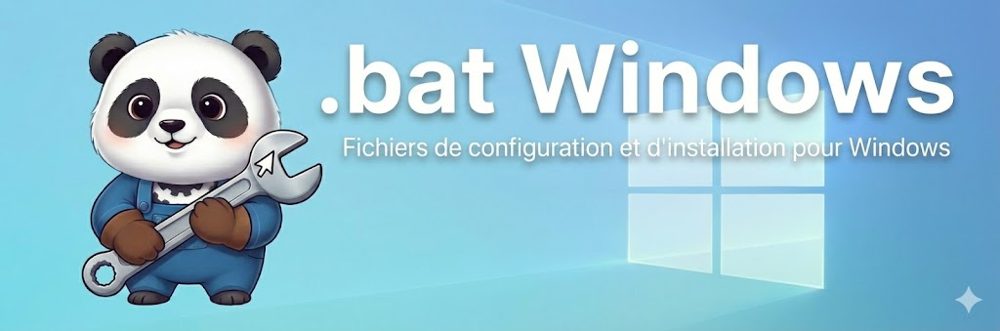

<p align="center">
  
</p>

<p align="center">
  <a href="https://www.microsoft.com/windows"></a>
  <a href="https://github.com/microsoft/winget-cli"></a>
  <a href="https://docs.microsoft.com/powershell/"></a>
  
</p>

# Scripts d'installation Windows by Eldayia

Scripts modulaires pour le téléchargement et l'installation automatique de logiciels Windows. Architecture inspirée de la configuration NixOS avec une organisation thématique claire.

## 🆕 Nouveautés récentes

### Environnement de développement complet (Décembre 2024)
- ✅ **Android Studio** - Développement mobile Android avec SDK complet
- ✅ **Support multilangage complet** - C++, C#, Python, Rust, Java, JavaScript/TypeScript
- ✅ **Outils modernes JavaScript** - TypeScript, Vite, Vue CLI, ESLint, Prettier (via npm)
- ✅ **Compilation C++** - LLVM/Clang, MinGW-w64, CMake, MSVC Build Tools
- ✅ **Revo Uninstaller Pro** - Disponible pour tous les PC (Desktop et Laptop)

### Architecture modulaire
- ✅ **Structure inspirée de NixOS** - Organisation par modules thématiques
- ✅ **8 modules spécialisés** - Archives, Communication, Développement, Gaming, Multimédia, Productivité, Sécurité, Outils système, Web
- ✅ **Fonctions réutilisables** - DRY (Don't Repeat Yourself)
- ✅ **Maintenance simplifiée** - Ajout/suppression de logiciels en quelques lignes

### Fonctionnalités
- ✅ **Téléchargement automatique** via Winget (78 logiciels)
- ✅ **Installation adaptative** - Mode Desktop (complet) ou Laptop (sans gaming)
- ✅ **Fallback intelligent** vers curl si winget échoue
- ✅ **Téléchargement sélectif** - Exécuter uniquement certains modules
- ✅ **Documentation complète** - README détaillé avec exemples

---

## 📦 Logiciels disponibles (78)

### Archives & Compression (1)
- **NanaZip** - Gestionnaire d'archives moderne (téléchargement manuel)

### Communication (1)
- **Vesktop** - Client Discord alternatif open-source (Vencord)

### Développement (20)
**Éditeurs de code et IDE (4)**
- **Visual Studio Code** - Éditeur de code
- **Cursor** - IDE avec IA
- **Android Studio** - IDE pour développement Android
- **Visual Studio Community 2026** - IDE complet avec Visual Studio Installer

**Contrôle de version (2)**
- **Git** - Gestion de versions
- **GitKraken** - Client Git graphique

**Langages de programmation et runtimes (5)**
- **OpenJDK 21** - Java Development Kit
- **.NET SDK 8** - Framework C#
- **Python 3.12** - Langage de programmation
- **Rustup** - Toolchain Rust
- **Node.js** - Runtime JavaScript (inclut npm)

**Outils de build et compilation C++ (4)**
- **CMake** - Build system multiplateforme
- **LLVM** - Compilateur Clang
- **MinGW-w64** - GCC pour Windows (téléchargement manuel)
- **MSVC Build Tools** - Inclus avec Visual Studio

**Outils JavaScript/TypeScript (via npm post-installation)**
- **TypeScript** - Typage statique pour JavaScript
- **Vite** - Build tool rapide
- **Vue CLI** - Interface en ligne de commande Vue.js
- **ESLint** - Linter JavaScript
- **Prettier** - Formateur de code

**Outils Android (inclus avec Android Studio)**
- **Android SDK** - Kit de développement Android
- **Android Platform Tools** - Outils en ligne de commande (adb, fastboot)
- **Android Emulator** - Émulateur de périphériques
- **Gradle** - Système de build

**Conteneurs et virtualisation (1)**
- **Docker Desktop** - Conteneurisation

**Création de contenu interactif (1)**
- **Twine** - Création d'histoires interactives (téléchargement manuel)

### Gaming (13 + 1 inclus - Desktop uniquement)
- **Steam** - Plateforme Valve
- **Epic Games Launcher** - Store Epic (inclut Epic Online Services)
- **GOG GALAXY** - Client GOG
- **Battle.net** - Plateforme Blizzard
- **EA app** - Electronic Arts
- **Ubisoft Connect** - Plateforme Ubisoft
- **Amazon Games** - Client Amazon
- **Riot Client** - League of Legends, Valorant
- **Wargaming.net Game Center** - World of Tanks, etc.
- **HoYoPlay** - Genshin Impact, Honkai Star Rail
- **BlueStacks** - Émulateur Android pour gaming
- **CurseForge** - Mods Minecraft et autres jeux
- **Ankama Launcher** - Dofus, Wakfu

### Multimédia (5)
- **VLC media player** - Lecteur vidéo universel
- **Mp3tag** - Éditeur de tags audio
- **Apple Music** - Streaming musical
- **Adobe Creative Cloud** - Suite créative
- **qBittorrent** - Client BitTorrent

### Productivité (16)
- **1Password** - Gestionnaire de mots de passe
- **1Password CLI** - Version ligne de commande
- **PowerToys** - Utilitaires Microsoft
- **Rainmeter** - Personnalisation du bureau
- **FileZilla** - Client FTP
- **WinSCP** - Client SFTP/SCP
- **eM Client** - Client email
- **TreeSize** - Analyseur d'espace disque
- **UltraSearch** - Recherche rapide de fichiers
- **UniGetUI** - Interface pour gestionnaires de paquets
- **Warp** - Terminal moderne
- **UPDF** - Éditeur PDF
- **Wondershare Recoverit** - Récupération de données (téléchargement manuel)
- **ReNamer** - Renommage en masse
- **Eagle** - Gestionnaire d'assets pour designers
- **Obsidian** - Prise de notes et gestion de connaissances

### Sécurité (4)
- **Bitdefender Total Security** - Antivirus (téléchargement manuel)
- **NordVPN** - VPN
- **Acronis True Image** - Sauvegarde (téléchargement manuel)
- **Tor Browser** - Navigateur anonyme

### Outils système (16)
**Périphériques (5 - Desktop uniquement)**
- **Samsung Magician** - Gestion SSD Samsung
- **Elgato Stream Deck** - Contrôleur de streaming (téléchargement manuel)
- **Logi Options+** - Configuration souris/claviers Logitech
- **Logitech G HUB** - Périphériques gaming Logitech
- **DisplayLink Graphics** - Pilotes adaptateurs DisplayLink (téléchargement manuel)

**Personnalisation et utilitaires (4)**
- **Stardock Start11** - Personnalisation menu démarrer Windows 11
- **Stardock Multiplicity** - KVM logiciel multi-PC (téléchargement manuel)
- **TeamViewer** - Bureau à distance
- **Revo Uninstaller Pro** - Désinstallation avancée (tous les PC)

**Virtualisation et réseau (2)**
- **VMware Workstation** - Virtualisation (téléchargement manuel)
- **QNAP Qsync Client** - Synchronisation NAS QNAP (téléchargement manuel)

**Matériel et outils spécialisés (2)**
- **Raspberry Pi Imager** - Flasher cartes SD pour Raspberry Pi
- **OrcaSlicer** - Slicer pour imprimantes 3D

**Divers (3)**
- **Comet** - Navigateur de fichiers cloud 115
- **LM Studio** - Exécution de modèles IA en local
- **Shutter** - Outil de capture d'écran (téléchargement manuel)

### Navigateurs Web (2)
- **Google Chrome** - Navigateur Google
- **Google Chrome Canary** - Version de développement

## 📁 Structure du dépôt

```
dotfiles/
├── README.md                     # Ce fichier
├── README_MODULES.md             # Documentation technique détaillée
├── CLAUDE.md                     # Directives pour IA
└── install/                      # Scripts d'installation
    ├── downloadSoftware.bat      # Point d'entrée principal
    ├── downloadSoftware.bat.old  # Ancien fichier (backup)
    ├── common/
    │   └── functions.bat         # Fonctions réutilisables
    └── modules/                  # Modules par catégorie
        ├── archives.bat          # NanaZip
        ├── communication.bat     # Vesktop
        ├── development.bat       # Git, VSCode, Docker, Python, etc.
        ├── gaming.bat            # Steam, Epic, GOG, Battle.net, etc.
        ├── multimedia.bat        # VLC, Mp3tag, Adobe CC, etc.
        ├── productivity.bat      # 1Password, PowerToys, FileZilla, etc.
        ├── security.bat          # Bitdefender, NordVPN, Acronis
        ├── system-tools.bat      # Samsung Magician, Logitech, VMware, etc.
        └── web.bat               # Chrome, Chrome Canary
```

## 🚀 Utilisation

### Télécharger tous les logiciels

```batch
cd install
downloadSoftware.bat
```

Ce script va :
1. Vous demander si c'est un PC Desktop ou Laptop
   - **Desktop** : Installation complète (gaming, périphériques, etc.)
   - **Laptop** : Installation sans gaming ni périphériques Desktop
2. Créer le dossier `Downloads\` s'il n'existe pas
3. Appeler tous les modules dans l'ordre
4. Télécharger via winget ou curl
5. Afficher un récapitulatif des téléchargements manuels requis

### Post-installation : Outils npm pour développement JavaScript/TypeScript

Après l'installation de Node.js, installer les outils de développement globaux :

```batch
npm install -g typescript
npm install -g vite
npm install -g @vue/cli
npm install -g eslint
npm install -g prettier
```

Ces outils fournissent un environnement complet pour le développement moderne JavaScript/TypeScript, Vue.js et React.

### Télécharger une catégorie spécifique

```batch
cd install\modules
call gaming.bat
```

Ou depuis PowerShell :
```powershell
.\install\modules\gaming.bat
```

### Exemples d'utilisation

**Télécharger uniquement les outils de développement :**
```batch
call install\modules\development.bat
```

**Télécharger gaming + multimédia :**
```batch
call install\modules\gaming.bat
call install\modules\multimedia.bat
```

## ✏️ Gestion des logiciels

### Ajouter un logiciel

1. Identifier le module approprié (ex: `install\modules\gaming.bat`)
2. Ouvrir le fichier dans un éditeur
3. Ajouter une ligne :

```batch
REM Minecraft
call :DownloadSoftware "Minecraft" "Mojang.MinecraftLauncher" "" ""
```

**Paramètres :**
- Nom du logiciel (affiché)
- ID Winget
- URL de fallback (optionnel, mettre `""` si absent)
- Nom du fichier de fallback (optionnel, mettre `""` si absent)

**Exemple avec fallback :**
```batch
REM OBS Studio
call :DownloadSoftware "OBS Studio" "OBSProject.OBSStudio" "https://cdn-fastly.obsproject.com/downloads/OBS-Studio-30.0-Windows.exe" "OBS-Studio-Setup.exe"
```

### Supprimer un logiciel

1. Ouvrir le module correspondant
2. Commenter la ligne avec `REM` :

```batch
REM call :DownloadSoftware "Vesktop" "Vencord.Vesktop" "" ""
```

Ou supprimer complètement la ligne.

### Modifier un logiciel

Modifier directement les paramètres dans le module :

```batch
REM Avant
call :DownloadSoftware "Steam" "Valve.Steam" "" ""

REM Après (ajout d'un fallback)
call :DownloadSoftware "Steam" "Valve.Steam" "https://cdn.cloudflare.steamstatic.com/client/installer/SteamSetup.exe" "SteamSetup.exe"
```

## 🛠️ Fonctions disponibles

Les fonctions sont définies dans `install\common\functions.bat`.

### DownloadSoftware

Télécharge via winget, puis tente curl si échec.

```batch
call :DownloadSoftware "Nom" "ID_Winget" "URL_Fallback" "Nom_Fichier"
```

### ManualDownloadRequired

Affiche un message pour téléchargement manuel.

```batch
call :ManualDownloadRequired "Nom" "URL"
```

### IncludedWith

Indique qu'un logiciel est inclus avec un autre.

```batch
call :IncludedWith "Nom" "Inclus_Dans"
```

## 🔄 Avantages de l'architecture modulaire

### Avant (monolithique)
- ❌ 1 fichier de 401 lignes
- ❌ Difficile à naviguer
- ❌ Modifications risquées
- ❌ Pas de réutilisation de code
- ❌ Tout ou rien

### Après (modulaire)
- ✅ 11 fichiers organisés (10 + backup)
- ✅ Navigation facile par catégorie
- ✅ Modifications isolées et sûres
- ✅ Fonctions réutilisables (DRY)
- ✅ Téléchargement sélectif possible
- ✅ Similaire à l'architecture NixOS

## 📝 Prérequis

- **Windows 10/11**
- **Winget** (installé par défaut sur Windows 11, ou via Microsoft Store sur Windows 10)
- **Curl** (inclus dans Windows 10 1803+ et Windows 11)

### Vérifier Winget

```powershell
winget --version
```

Si absent, installer depuis le [Microsoft Store](https://www.microsoft.com/p/app-installer/9nblggh4nns1) ou [GitHub](https://github.com/microsoft/winget-cli/releases).

## 📚 Documentation

- **[README_MODULES.md](README_MODULES.md)** - Documentation technique détaillée
  - Architecture complète
  - Exemples avancés
  - Liste exhaustive des modules
  - Conseils et notes techniques

## 🎯 Cas d'usage

### Installation complète d'une nouvelle machine

1. Cloner le dépôt
2. Aller dans le dossier install : `cd install`
3. Exécuter `downloadSoftware.bat`
4. Attendre la fin des téléchargements
5. Installer manuellement les logiciels requis
6. Installer les paquets téléchargés depuis `Downloads\`

### Mise à jour sélective

Télécharger uniquement les catégories nécessaires :

```batch
call install\modules\development.bat
call install\modules\productivity.bat
```

### Installation sur machine gaming

```batch
call install\modules\gaming.bat
call install\modules\multimedia.bat
call install\modules\communication.bat
```

### Installation sur poste de développement

```batch
call install\modules\development.bat
call install\modules\productivity.bat
call install\modules\web.bat
```

Le module `development.bat` installe un environnement complet couvrant :
- **C++** : LLVM/Clang, MinGW-w64, CMake, MSVC Build Tools
- **C#** : .NET SDK 8
- **Python** : Python 3.12
- **Rust** : Rustup toolchain
- **Java** : OpenJDK 21
- **JavaScript/TypeScript** : Node.js, npm, TypeScript, Vite, Vue CLI, ESLint, Prettier
- **Android** : Android Studio avec SDK, Platform Tools, Emulator et Gradle
- **Conteneurs** : Docker Desktop

## 🔗 Liens utiles

- [Winget Documentation](https://docs.microsoft.com/windows/package-manager/)
- [Winget Package Search](https://winget.run/)
- [PowerShell Documentation](https://docs.microsoft.com/powershell/)

## 💡 Conseils

1. **Sauvegarde** : `install/downloadSoftware.bat.old` est conservé comme backup
2. **Tests** : Tester un module individuellement avant utilisation complète
3. **Commentaires** : Utiliser `REM` pour désactiver temporairement des logiciels
4. **Variables** : `%DOWNLOAD_DIR%` est accessible dans tous les modules
5. **Ordre** : L'ordre d'exécution des modules peut être modifié dans `install/downloadSoftware.bat`

## 🤝 Contribuer

Ce dépôt est personnel mais les suggestions sont bienvenues. Pour ajouter un logiciel :

1. Fork le projet
2. Créer une branche (`git checkout -b feature/nouveau-logiciel`)
3. Ajouter le logiciel dans le module approprié
4. Commit (`git commit -m 'feat: ajout de Nouveau Logiciel'`)
5. Push (`git push origin feature/nouveau-logiciel`)
6. Ouvrir une Pull Request

## 📄 Licence

Configuration personnelle - Utilisation libre avec attribution.

---

<p align="center">
  Made with ❤️ by Eldayia
</p>
